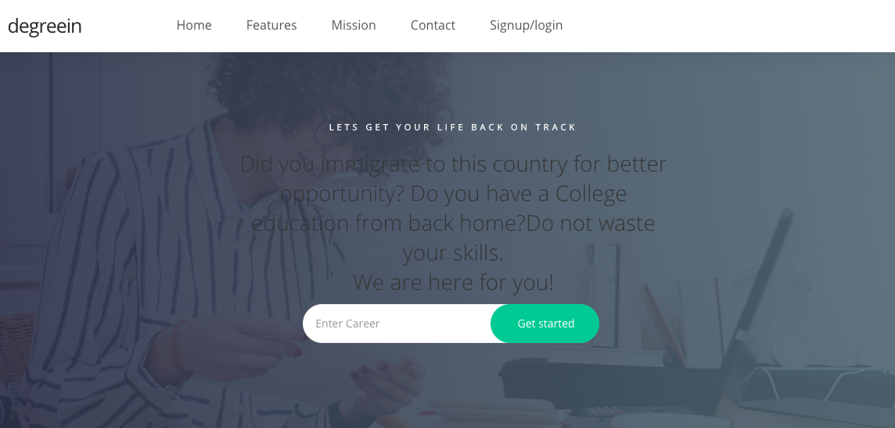

# Project: Web Application for college educated immigrants

# Goal: To aid immigrants who had college educations back home and want to use that education here in the states.

# Why:
## Too many immigrants come to the USA for better opportunity but when they come here they do not how to navigate through some of the systems. Some immigrants come here with educations from the countries they came from but they end up not being able to use those degrees.this is due to lack of understanding or mentorship to guide them back to using the degrees they have. I made this web application to help those people out.

usage:
clone repo
npm install

npm run start
localhost:8080

# Technologies Html, css,express, mongodb,javascript,node.js

